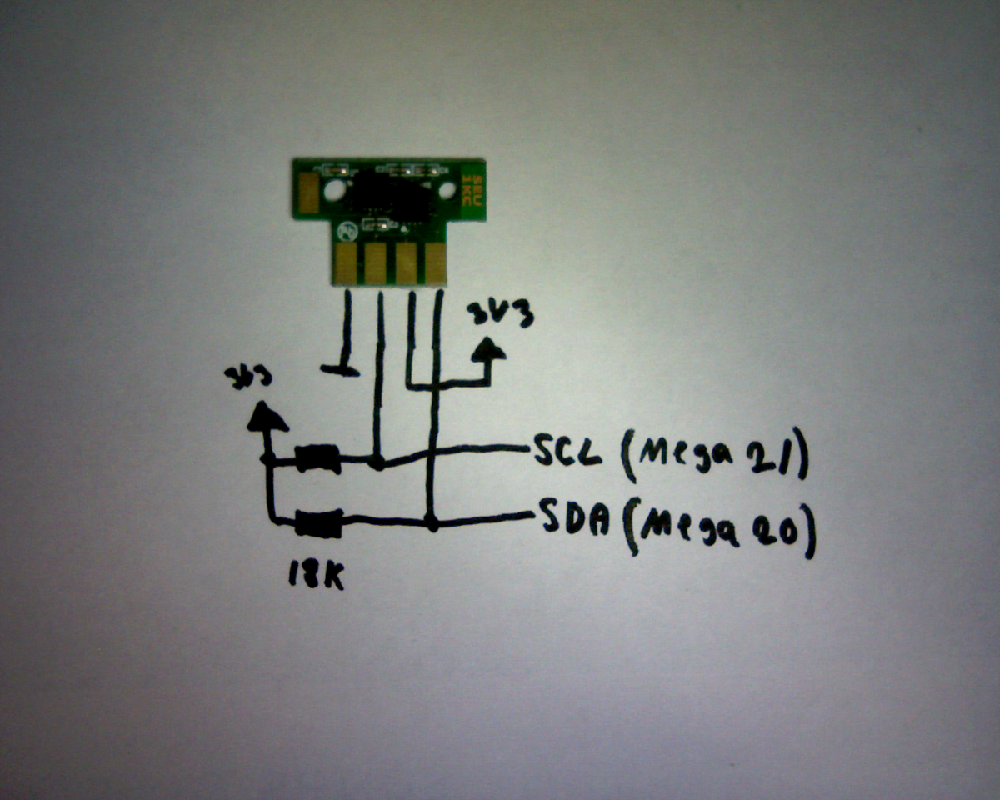

# ESP32 Toner Chip Resetter for Lexmark and compatible printers

This project provides a simple and effective solution for resetting the toner chip on various Lexmark printers using an ESP32 microcontroller. By resetting the chip, you can extend the life of your toner cartridges and reduce printing costs.

## Features

- **Toner Chip Reset:** Resets the page counter and toner level on the TI046B1 chip used in many Lexmark toner cartridges.
- **Simple Operation:** A single button press triggers the reset process.
- **Visual Feedback:** A WS2812B RGB LED provides clear status updates:
    - **Green:** Ready for operation.
    - **White:** Resetting Black cartridge.
    - **Cyan:** Resetting Cyan cartridge.
    - **Magenta:** Resetting Magenta cartridge.
    - **Yellow:** Resetting Yellow cartridge.
    - **Blinking Red:** No cartridge detected.
- **PlatformIO Based:** Easy to build and upload using PlatformIO and Visual Studio Code.

## Compatible Printers

This tool is designed to work with printers that use toner cartridges with the TI046B1 chip. The following Lexmark printers are known to be compatible:

- CX310
- CX310dn
- CX410
- CX510
- CX410dte
- CX510de

It may also be compatible with other Lexmark, Dell, and Konica Minolta printers that use the same toner chip.

## Hardware Requirements

- **ESP32 Development Board:** Any ESP32 board should work (e.g., ESP32-WROOM-32, ESP-WROVER-KIT).
- **Push Button:** A standard momentary push button.
- **WS2812B RGB LED:** A single addressable RGB LED (e.g., a NeoPixel).
- **Jumper Wires:** For connecting the components.

## Wiring

| Component      | ESP32 Pin |
| -------------- | --------- |
| I2C SDA        | GPIO 21   |
| I2C SCL        | GPIO 22   |
| Push Button    | GPIO 12   |
| WS2812B LED    | GPIO 13   |

**Note:** The push button should be connected between GPIO 12 and GND. The WS2812B LED's data pin should be connected to GPIO 13. The I2C pins (SDA and SCL) are used to communicate with the toner chip.

## Chip Pinout

For SDA and SCL, a 10k pull-up resistor is used.

## How to Use

1.  **Connect the ESP32 to the toner cartridge:** Connect the SDA and SCL pins of the ESP32 to the corresponding pins on the toner chip.
2.  **Power on the ESP32:** The LED will turn green, indicating that the device is ready.
3.  **Press the button:** The reset process will begin. The LED will change color based on the detected cartridge.
4.  **Wait for the process to complete:** The LED will turn back to green after 5 seconds. If no cartridge is detected, the LED will blink red for 5 seconds.

## Building and Uploading

This project is configured for PlatformIO.

1.  **Install Visual Studio Code and PlatformIO:** If you haven't already, install VS Code and the PlatformIO IDE extension.
2.  **Open the project:** Open this project folder in Visual Studio Code.
3.  **Build and Upload:** Click the "Upload" button in the PlatformIO toolbar at the bottom of the VS Code window. PlatformIO will automatically handle the dependencies and upload the firmware to your ESP32.

## Disclaimer

This project is for educational purposes only. Use it at your own risk. The author is not responsible for any damage to your printer or toner cartridges.

## References

This project is based on the research and work of the Pori Hacklab. For more information, please visit their blog post:
[https://pori.hacklab.fi/wordpress/?p=1114](https://pori.hacklab.fi/wordpress/?p=1114)
